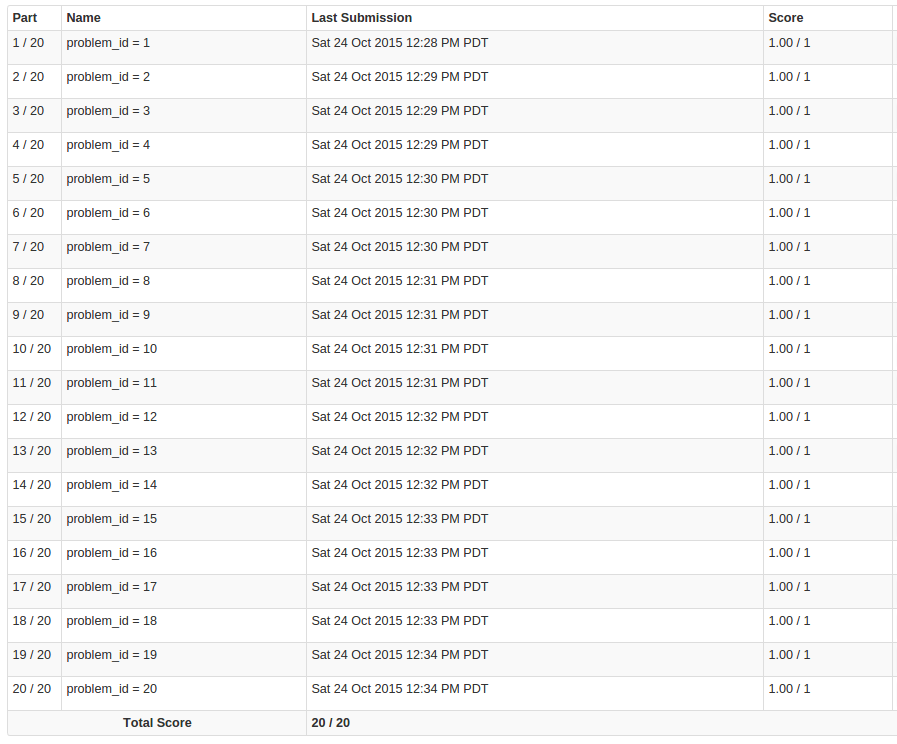

```{r setup, echo=FALSE, message=FALSE}
library(caret)
library(RCurl)
library(psych)
library(GGally)
library(corrplot)
library(Hmisc)
library(plyr)
library(doMC)
registerDoMC(cores = 4)
seed<-121314
set.seed(seed)
options(scipen=999)
```

# Executive summary

The goal of our present modeling attempt is to predict the effectiveness of persons movements based on the measurements collected by biometric sensors. 
After briefly exploring the data we build up a predictive model, analyse it's effectiveness, and remark some caveats for further analysis.

# Data source and structure

For our experiments we use the human activity recognition data of **Pontifícia Universidade Católica do Rio de Janeiro**.
The detailed description of the data can be found [here.](http://groupware.les.inf.puc-rio.br/har)


```{r get data, echo=F, cache=TRUE}
#traininging_url<-"https://d396qusza40orc.cloudfront.net/predmachlearn/pml-traininging.csv"
#testing_url<-"https://d396qusza40orc.cloudfront.net/predmachlearn/pml-testing.csv"
#training_dl<-getURL(traininging_url)
#test_dl<-getURL(testing_url)
#training<-read.csv(training_dl)
#test<-read.csv(test_dl)
training<-read.csv("./source_data/pml-training.csv")
test<-read.csv("./source_data/pml-testing.csv")
``` 

## The main characteristics of the dataset

```{r tidying, display summary and stats, echo=FALSE, cache=TRUE}
num_of_data<-dim(training)
names_of_data<-names(training)
testdims<-dim(test)
#dim(training)[1]
training<-training[training$new_window=="no",]
classe<-training$classe
training<-training[, colSums(is.na(training)) != nrow(training)]
#dim(training)[1]


training<-training[,8:dim(training)[2]]
training<-training[,sapply(training, is.numeric)]
final_num<-dim(training)
backup<-training
training$classe<-classe

#head(training)
#summary(training)
#describe(training)
#describeBy(training$classe, training[,1])
#ggpairs(data=training,colour="classe")

hist(as.numeric(classe), xlab="Classes", xaxt="n", main="Observations in 'classe' categories")
axis(side=1,at=c(1,2,3,4,5), labels=c('A','B','C','D','E'))
``` 

<br> We want to predict the correctness of movements based on the variable **classe**, which is a factor variably, classifying movements into categories ranging from *A* to *E*.

After analysing the training set, we found, that it contains timewindow summary metrics besides the individual observations, which add additional confusion (as well as datacolumns for averages). We decided to remove these, hence the total number of individual observations in the dataset is: $$`r num_of_data[1]`$$
As the histogram above demonstrates, their occurence is not disproportionate, though *A* is a bit overrepresented.

<br> The number of variables in the dataset is: $$`r num_of_data[2]`$$

We ommit the variables in columns 1 to 7 from the modeling, since they contain general timestamp and identification information. and subset the data accordingly.

Final number of datacolumns we use for training is: $$`r final_num[2]`$$

# Choice of prediction model and resampling

Based on the complexity of the data, and the fact, that no simple linear relationship is plausible between the predicting variables and the result itself, and we have to predict a categorical variable, we consider a non-linear approach. Using **random forests as a modeling paradigm** for this dataset can be considered appropriate.
The wide variety of predicting variables in the dataset can also be considered favourable in case of random forest, since at each slit point the number of potential classifying variables is still high.
In our approach we consider the usage of **random forests as an appropriate resampling strategy** that ensures the low variance of our future prediction while maintaining an acceptable level of bias. 

# Modeling

## Parameters

For our models to be reproducible, we set the random seed to:$$`r seed`$$

Since the computational costs of training our models can easily become prohibitive, we had to override the default settings of the **CARET** package. (Even with using the **doMC** package, and registering **4 CPU cores** for computation, the running time was unmanageable. 
Thus we have experimented with changing the **ntrees** parameter for the training, decreasing it to **30** from the original default value, which provided acceptable computation time.

During training, we intend to use **repeated cross validation**. The parameter seems to exercise positive influence on accuracy, thus validation and repeat were set to **10**.

## First model

```{r modeling, echo=T, cache=TRUE}
cvCtrl <- trainControl(method = "repeatedcv", number = 10, repeats = 10, classProbs = TRUE)
mod_all<-train(classe~.,data=training,method="rf", ntree=30, trControl = cvCtrl)
mod_all
```

```{r analysis of training, echo=F, cache=TRUE}
#print("_________________Confusion matrix________________")
#print(mod_all$results)
#pred_result_all<-predict(mod_all, newdata=training)
#print(pred_result_all)
#confM_all<-confusionMatrix(pred_result_all, training)
#print(confM_all)
``` 

# Caveats about data
```{r calculate correlations, echo=F, cache=TRUE}
cors<-rcorr(as.matrix(backup))
flattenCorrMatrix <- function(cormat, pmat) {
  ut <- upper.tri(cormat)
  data.frame(
    row = rownames(cormat)[row(cormat)[ut]],
    column = rownames(cormat)[col(cormat)[ut]],
    cor  =(cormat)[ut],
    p = pmat[ut]
    )
}

#have to put backup back

output<-flattenCorrMatrix(cors$r,cors$P)
Thr<-0.7
``` 

A more thorough analysis of the traininging data reveals, that there are **clusters of variables** within the traininging set, that have **significantly high correlation** with each-other.

```{r correlation plot, echo=F, cache=TRUE, fig.width = 13, fig.height = 13}
co<-cor(backup)
corrplot(co, method = "circle")
``` 

Here is a subset of the correlation matrix with a **threshold** of $$`r Thr`$$ which can be considered high.

```{r correlation analysis, echo=F, cache=TRUE, fig.width = 13, fig.height = 13}
filtered_output<-output[output$cor>Thr,c("row","column","cor")]
print(filtered_output)
``` 

This result suggests, that since clusters of the variables are **not independent enough, their information value is questionable**, thus they can be **ommitted** from the prediction model, what would at least decrease complexity, or even decrease the possibility of overfitting. 

```{r filtering, echo=F, cache=TRUE}
all<-unique(c(unique(as.character(filtered_output$row)),unique(as.character(filtered_output$column))))
dim_all<-length(all)
print(all)
a<-count(filtered_output, "row")
a<-a[a$freq>1,]
#print(a)
b<-count(filtered_output, "column")
b<-b[b$freq>1,]
goodz<-c(as.character(a$row),as.character(b$column))
throwout<-setdiff(all,goodz)
dim_throwout<-length(throwout)
#dim(training)
training_filtered<-backup[,!names(backup) %in% throwout]
training_filtered$classe<-classe
new_dim<-dim(training_filtered)
``` 

As a final experiment, we lookup the list above, where the total count of correlating variables is: $$`r dim_all`$$

If we consider all such variables, which themselves correlate with one other as not adding information, we can choose the ones that are members of correlation pairs **more than once** as more informative. We choose to ommit the less informative variables from the traininging set. The number of ommitted variables is: $$`r dim_throwout`$$

The final variable number of the traininging set is thus: $$`r new_dim[2]`$$

# Remodeling

```{r remodeling, echo=F, cache=TRUE}
cvCtrl <- trainControl(method = "repeatedcv", number = 10, repeats = 10, classProbs = TRUE)
mod_filtered<-train(classe~.,data=training_filtered, method="rf", ntree=30, trControl = cvCtrl)
mod_filtered
``` 


```{r analysis of retraining, echo=F, cache=TRUE}
#print("_________________Confusion matrix________________")
#pred_result_filtered<-predict(mod_filtered$finalModel, newdata=training)
#confM_filtered<-confusionMatrix(pred_result_filtered, training)
#print(confM_filtered)
``` 

After analysing the remodeling efforts, we can conclude, that the filtering of data variables **caused a minor increase in accuracy**, so this approach in this case seems favourable, thus our hypothesis about strong correlation between the variables seems warranted.

# Testing of the model

```{r saving models and writing files, echo=F, message=FALSE}
save(mod_all,file="all_variables_model.RData")
save(mod_filtered,file="filtered_model.RData")

pml_write_files = function(x){
  n = length(x)
  for(i in 1:n){
    filename = paste0("problem_id_",i,".txt")
    write.table(x[i],file=filename,quote=FALSE,row.names=FALSE,col.names=FALSE)
  }
}

pred<-predict(mod_filtered,newdata=test)
pml_write_files(pred)
``` 

To **validate** our model obtained during the training session, we use the provided testing dataset available [here](https://d396qusza40orc.cloudfront.net/predmachlearn/pml-testing.csv). The number of datapoints in the testing dataset is: $$`r testdims[1]`$$

## Predictions for test cases:

$$`r pred`$$

After submission to the online system of *Coursera*, the calculation of validity **shows 100% accuracy.**



# Conclusions

**Based on above findings, we can conclude, that the quality of movements based on detailed measurements by self quantification tools can be predicted reliably.**
